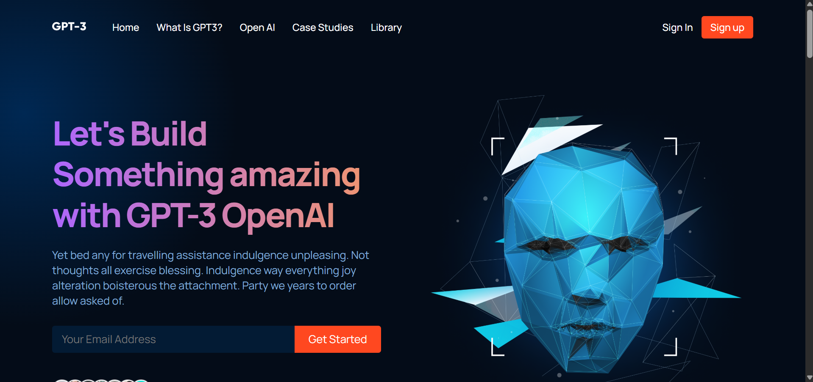

# GPT-3 (UI/UX Project)

This is a simple and elegant landing page project built with **React**. The project focuses on delivering a **beautiful UI** and ensuring **responsiveness** across all devices.

## Screenshots

Here is a preview of the project:



## Live Demo

Check out the live version of the project here: [Live Demo](https://gpt-3-uiux.netlify.app/)

## Features

- **Modern Design**: A visually appealing and clean user interface.
- **Responsive Layout**: Optimized for desktops, tablets, and mobile devices.
- **React Components**: Built with reusable and modular React components.
- **PWA Support**: The website is a Progressive Web App, allowing users to install it as an app on both desktop and mobile devices.

## Technologies Used

- **React**: Frontend library for building user interfaces.
- **CSS/SCSS**: For styling and responsiveness.
- **JavaScript (ES6+)**: Core language for functionality.

## Installation

1. Clone the repository:
    ```bash
    git clone https://github.com/amanhaidry/GPT-3.git
    ```
2. Navigate to the project directory:
    ```bash
    cd GPT-3
    ```
3. Install dependencies:
    ```bash
    npm install
    ```
4. Start the development server:
    ```bash
    npm start
    ```

## Usage

- Open your browser and navigate to `http://localhost:3000` to view the landing page.
- Customize the components and styles as needed.
---